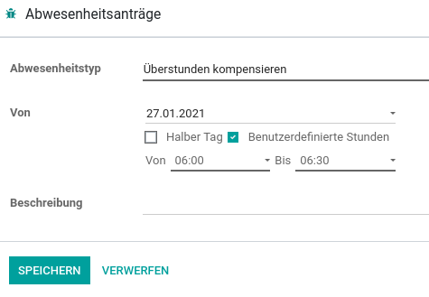

# Abwesenheitszeiten

## Feiertage einrichten

::: tip
Die Aktion erfordert die Installation des Moduls *HR Holidays Public*.
:::

Feiertage können für alle Mitarbeiter zentral festgelegt werden. Navigieren sie nach *Abwesenheitszeiten > Feiertage > Feiertage*. Hier erstellen sie die einzelnen Feiertage für das aktuelle Kalenderjahr.

In den [Demodaten](////////datenmanagement.html.html.html.html.html.html.html.html#demodaten-anzeigen) der Mint System sind Feiertage zum Import bereitgestellt.

## Abwesenheitstyp in theoretischen Stunden einbeziehen

::: tip
Damit der Abwesenheitstyp in der Auswertung [Theoretische und tatsächliche Anwesenheitszeiten vergleichen](////////anwesenheitszeiten.html.html.html.html.html.html.html.html#theoretische-und-tatsachliche-anwesenheitszeiten-vergleichen) berücksichtigt wird muss dies explizit festgelegt werden.
:::

Öffnen Sie den Abwesenheitstyp mit *Abwesenheitszeiten > Konfiguration > Abwesenheitstypen*. Bearbeiten sie den Typ und wählen sie die Checkbox *in theoretische Stunden einbeziehen* unter *Optionen*. Schliessen sie den Vorgang ab. Nun wird der Abwesenheitstyp in der theoretischen Stunden berücksichtigt.

## Abweseneitstype Überstunden kompensieren anlegen

Damit Mitarbeiter ihre Überstunden kompensieren können, braucht es einen entsprechenden Abwesenheitstyp.

Navigieren sie nach *Abwesenheitszeiten > Konfiguration > Abwesenheitstypen* und erstellen einen neuen Eintrag. Wählen sie als *Work Entry Type* *Anwesend* und *Einheit der Abwesenheit* *Stunden*.

#FIXME

## Überstunden beziehen

Möchte ein Mitarbeiter seine Überstunden beziehen, gibt er diese als Abwesenheit ein. Angenommen man hat 00:29 Stunden Überzeit, so öffnet man als erstes die *Abwesenheitszeiten.*

Hier wählt man *Neuer Abwesenheitsantrag* und als Typ *Überstunden kompensieren*. Wurde der Abwesenheitsantrag angenomme und gespeichert, wird dies als Arbeitszeit berücksichtigt.

[📝 Edit on GitHub](///////https://github.com/mint-system/odoo-handbuch/blob/master/abwesenheitszeiten.html.html.html.html.html.html.html)

<footer>Copyright © <a href="https://www.mint-system.ch/">Mint System GmbH</a></footer>

[📝 Edit on GitHub](//////https://github.com/mint-system/odoo-handbuch/blob/master/abwesenheitszeiten.html.html.html.html.html.html)

<footer>Copyright © <a href="https://www.mint-system.ch/">Mint System GmbH</a></footer>

[📝 Edit on GitHub](/////https://github.com/mint-system/odoo-handbuch/blob/master/abwesenheitszeiten.html.html.html.html.html)

<footer>Copyright © <a href="https://www.mint-system.ch/">Mint System GmbH</a></footer>

[📝 Edit on GitHub](////https://github.com/mint-system/odoo-handbuch/blob/master/abwesenheitszeiten.html.html.html.html)

<footer>Copyright © <a href="https://www.mint-system.ch/">Mint System GmbH</a></footer>

[📝 Edit on GitHub](///https://github.com/mint-system/odoo-handbuch/blob/master/abwesenheitszeiten.html.html.html)

<footer>Copyright © <a href="https://www.mint-system.ch/">Mint System GmbH</a></footer>

[📝 Edit on GitHub](//https://github.com/mint-system/odoo-handbuch/blob/master/abwesenheitszeiten.html.html)

<footer>Copyright © <a href="https://www.mint-system.ch/">Mint System GmbH</a></footer>

[📝 Edit on GitHub](/https://github.com/mint-system/odoo-handbuch/blob/master/abwesenheitszeiten.html)

<footer>Copyright © <a href="https://www.mint-system.ch/">Mint System GmbH</a></footer>

[📝 Edit on GitHub](https://github.com/Mint-System/Odoo-Handbuch/blob/master/abwesenheitszeiten.md)

<footer>Copyright © <a href="https://www.mint-system.ch/">Mint System GmbH</a></footer>