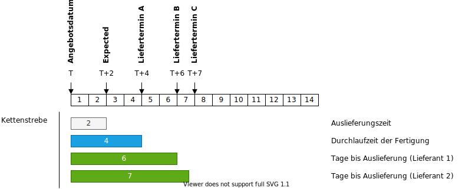

# Liefertermin verschieben
## Beispiel (Liefertermin A)
Wir erstellen ein Angebot für 10 Stk *Kettenstrebe* an den Kunden *Fahrrad-Traum AG*. Der Liefertermin wird auf *Heute + 6 Tage* gesetzt und das Angebot bestätigt. Die Warnfarbe bei *Menge* ist rot. Wir haben also nicht genügend Ware an Lager.

Der Aufruf von *Replenishment* zeigt nun eine leere Liste. Das ergibt sich daraus, dass die definierte *Durchlaufzeit der Fertigung* von 4 Tagen (siehe [Lead Times](////////best-practice-definition-beispiel-fahrrad.html.html.html.html.html.html.html.html#lead-times)) noch keinen Fertigungsauftrag verlangt.

Der Bericht *Prognostizierter Bestand* zeigt, dass wir in 6 Tagen -10 Stk *Kettenstreben* an Lager haben.

Jetzt verschieben wir den Liefertermin auf  *Heute + 3 Tage*. Dafür wird der Verkaufsauftrag zuerst mit den entsprechenden Funktionen abgebrochen und wieder in den Status *Angebot* gesetzt.

::: warning Angebot abbrechen
Damit die Reservationen richtig durchgeführt werden, muss der Verkaufsauftrag mit der Funktion *ABBRECHEN* und *SETZE AUF ANGEBOT* neu initialisiert werden.
:::

Jetzt erscheint nach dem Aufruf von *Replenish* der Artikel in der Liste. Das System schlägt vor, 10 Stk des Produktes zu produzieren. Mit dem Knopf *Order Once* wird automatisch der entsprechende Fertigungsauftrag erstellt.

### Variante Liefertermin B
Falls in der Meldestandsregel die *Preferred Route* auf *Einkaufen* eingestellt wird, erscheint im *Replenishment* bereits mit dem Liefertermin *Heute + 6 Tage* ein Eintrag in der Liste. Das System schlägt vor, 10 Stk des Artikels *Kettenstrebe* zu bestellen.

### Variante Liefertermin C

Falls in der Definition *Einkauf* für das Produkte *Kettenstrebe* der Lieferant *Metall und Profile GmbH* zu oberst steht, dann würde im *Replenishment* unmittelbar ein Bestellvorschlag erscheinen, wenn der Liefertermin auf *Heute + 7 Tage* gesetzt wird.

[📝 Edit on GitHub](///////https://github.com/mint-system/odoo-handbuch/blob/master/best-practice-liefertermin-verschieben.html.html.html.html.html.html.html)

<footer>Copyright © <a href="https://www.mint-system.ch/">Mint System GmbH</a></footer>

[📝 Edit on GitHub](//////https://github.com/mint-system/odoo-handbuch/blob/master/best-practice-liefertermin-verschieben.html.html.html.html.html.html)

<footer>Copyright © <a href="https://www.mint-system.ch/">Mint System GmbH</a></footer>

[📝 Edit on GitHub](/////https://github.com/mint-system/odoo-handbuch/blob/master/best-practice-liefertermin-verschieben.html.html.html.html.html)

<footer>Copyright © <a href="https://www.mint-system.ch/">Mint System GmbH</a></footer>

[📝 Edit on GitHub](////https://github.com/mint-system/odoo-handbuch/blob/master/best-practice-liefertermin-verschieben.html.html.html.html)

<footer>Copyright © <a href="https://www.mint-system.ch/">Mint System GmbH</a></footer>

[📝 Edit on GitHub](///https://github.com/mint-system/odoo-handbuch/blob/master/best-practice-liefertermin-verschieben.html.html.html)

<footer>Copyright © <a href="https://www.mint-system.ch/">Mint System GmbH</a></footer>

[📝 Edit on GitHub](//https://github.com/mint-system/odoo-handbuch/blob/master/best-practice-liefertermin-verschieben.html.html)

<footer>Copyright © <a href="https://www.mint-system.ch/">Mint System GmbH</a></footer>

[📝 Edit on GitHub](/https://github.com/mint-system/odoo-handbuch/blob/master/best-practice-liefertermin-verschieben.html)

<footer>Copyright © <a href="https://www.mint-system.ch/">Mint System GmbH</a></footer>

[📝 Edit on GitHub](https://github.com/Mint-System/Odoo-Handbuch/blob/master/best-practice-liefertermin-verschieben.md)

<footer>Copyright © <a href="https://www.mint-system.ch/">Mint System GmbH</a></footer>