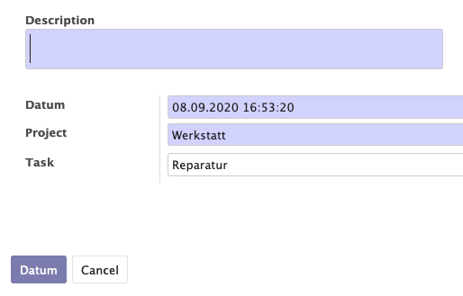
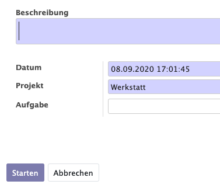

# Einstellungen Übersetzungen

## Übersetzungen aktualisieren

Mit jeder Odoo Version und den dazugehörigen Modulen werden neue Übersetzungen hinzugefügt. Um die aktuellsten Übersetzungen zu erhalten müssen sie folgende Aktion ausführen: Öffnen sie *Einstellungen > Sprachen > Sprachen verwalten > Sprache auswählen* und klicken auf *Aktivieren und Übersetzen*. Bestätigen sie den Dialog.

## Fehlende Begriffe generieren

Damit Begriffe überesetzt werden können, muss als erstes die Liste, der zu übersetzenden Begriffe aktualisiert werden.  Im [Entwicklermodus](////////einstellungen.html.html.html.html.html.html.html.html#entwicklermodus-aktivieren) folgende Aktionen ausführen:

*Einstellungen > Übersetzungen > Fehlende Begriffe generieren*.

Dann kann man die Übersetzungen über die Einstellungen anzeigen.

## Übersetzungen erstellen

Odoo wird in viele Sprachen übersetzt, daher kann es sein, dass die Lokalisierung in der eingestellte Sprache unvollständig ist.

Findet man einen Begriff oder Satz, der nicht korrekt übersetzt ist, kann man diesen selbst anpassen. Dazu ein Beispiel.

Der folgende Ausschnitt ist aus einem Odoo-Dialog. Die Labels und Buttons sind nicht übersetzt.

Als erstes muss man  die [Übersetzungen aktualisieren](////////einstellungen-übersetzung.html.html.html.html.html.html.html.html#ubersetzungen-aktualisieren). Anschliessend kann man in der Liste *Einstellungen > Übersetzungen > Übersetzte Begriffe* den englischen Begriff suchen und anpassen.

Nun ist der Odoo-Dialog übersetzt.

## Übersetzungen exportieren

Im Entwicklermodus öffnen sie den Export-Dialog via *Einstellungen > Übersetzungen > Import / Export > Übersetzung exportieren*. Wählen sie die zu exportierende Sprache, Datei-Format CSV und eine App deren Übersetzungen sie exportieren möchten. Drücken sie auf *Export* und laden die CSV-Datei herunter.

!> Organisieren sie die Übersetzung nach Apps

## Übersetzungen importieren

Im Entwicklermodus öffnen sie den Import-Dialog via *Einstellungen > Übersetzungen > Import / Export > Übersetzung importieren*. Für die Sprache Deutsch (Schweiz) geben sie die folgenden Informationen ein:
* Sprache: de
* Code: CH
Laden sie die Datei mit Übersetzungen hoch und klicken auf *Import*.

## Bestimmte Begriffe umbennen

Ist man mit einer bestimmte Übersetzung nicht zufrieden, können sie diese selber anpassen. Angenommen wir wollen auf der Rechnung *Zwischensumme* zu *Nettobetrag* umbennen, öffnen sie als erstes *Einstellungen > Übersetzungen > Übersetzt Begriffe*.

Suchen sie nach dem Übersetzungswert *Zwischensumme*. Es erscheinen mehrere Resultate. Für einen Begriff kann es mehrere gleiche Übersetzung geben, weil es mehrere unabhängige Odoo Apps gibt, die den gleichen Begriff verwenden.

In unserem Fall wollen wir die Einträge mit `<strong>...</strong>` anpassen. Wählen sie die entsprechenden Einträge aus und ersetzen sie *Zwischensumme* mit *Nettobetrag*.

[📝 Edit on GitHub](///////https://github.com/mint-system/odoo-handbuch/blob/master/einstellungen-übersetzung.html.html.html.html.html.html.html)

<footer>Copyright © <a href="https://www.mint-system.ch/">Mint System GmbH</a></footer>

[📝 Edit on GitHub](//////https://github.com/mint-system/odoo-handbuch/blob/master/einstellungen-übersetzung.html.html.html.html.html.html)

<footer>Copyright © <a href="https://www.mint-system.ch/">Mint System GmbH</a></footer>

[📝 Edit on GitHub](/////https://github.com/mint-system/odoo-handbuch/blob/master/einstellungen-übersetzung.html.html.html.html.html)

<footer>Copyright © <a href="https://www.mint-system.ch/">Mint System GmbH</a></footer>

[📝 Edit on GitHub](////https://github.com/mint-system/odoo-handbuch/blob/master/einstellungen-übersetzung.html.html.html.html)

<footer>Copyright © <a href="https://www.mint-system.ch/">Mint System GmbH</a></footer>

[📝 Edit on GitHub](///https://github.com/mint-system/odoo-handbuch/blob/master/einstellungen-übersetzung.html.html.html)

<footer>Copyright © <a href="https://www.mint-system.ch/">Mint System GmbH</a></footer>

[📝 Edit on GitHub](//https://github.com/mint-system/odoo-handbuch/blob/master/einstellungen-übersetzung.html.html)

<footer>Copyright © <a href="https://www.mint-system.ch/">Mint System GmbH</a></footer>

[📝 Edit on GitHub](/https://github.com/mint-system/odoo-handbuch/blob/master/einstellungen-übersetzung.html)

<footer>Copyright © <a href="https://www.mint-system.ch/">Mint System GmbH</a></footer>

[📝 Edit on GitHub](https://github.com/Mint-System/Odoo-Handbuch/blob/master/einstellungen-übersetzung.md)

<footer>Copyright © <a href="https://www.mint-system.ch/">Mint System GmbH</a></footer>