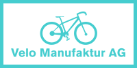

# Mitarbeit

In diesem Dokument werden die Vorgaben zur Mitarbeit am Odoo Handbuch erläutert.

## Theorie

Zur Erläuterung der Instruktionen darf man ein fiktives Unternehmen mit folgenden Informationen verwenden:



Name: Velo Manufaktur AG  
Website: https://www.example.com  
Mail: info@example.com
Odoo: https://erp.example.com  
Standort: Fahrradstrasse 64, Altdorf 6460, Schweiz  
Mitarbeiter: Kurt Gisler, Janik von Rotz, Marco Roeleven  
MWST: CHE-103.800.167  
IBAN: CH5604835012345678009  
Bank: Credit Suisse  
BIC: CRESCHZZ  

## Sprache

Die Artikel sind in der Sprache Deutsch und in der [Höflichkeitsform](////////https://de.wikipedia.org/wiki/h%c3%b6flichkeitsform.html.html.html.html.html.html.html.html). Das Subjektiv bleibt jedoch klein geschrieben.

Die Beschreibungen und Anleitungen sind ausführlich und kommen ohne Abkürzungen aus.

🚫"Fertigung/Stammdaten/Stückliste"  
✅ "Navigieren sie nach *Fertigung > Stammdaten > Stückliste* und klicken sie auf *+ Anliegen*."

Pfade und Bezeichnungen werden kursiv geschrieben.

🚫 Drücken sie auf "+ Anlegen"  
✅ Drücken sie auf *+ Anlegen*

## Markierungen

Um Inhalte speziell zu markieren gibt es diese Optionen.

Markup:
```
::: tip
Info
:::

::: warning
Warnung
::: tip
```

Output:

::: tip
Info
:::

::: warning
Warnung
:::

## Konventionen

**Keine Leerschläge**

Die Dateinamen der Artikel dürfen keine Leerschläge enthalten. Dies führt dazu das die generierte URL korrekt kopiert und eingefügt werden kann.

"Persönliche Einstellungen" -> "Persönliche-Einstellungen"

**Dateinamen Prefix**

Der Name eines Bildes beginnt mit dem Namen der Odoo App.

"Produkt anlegen" -> "Verkäufe Produkt anlegen"

## Bilder

Bilder sind im optimal im PNG-Format und mit Auflösung 800x500 gespeichert.  
Für Animationen kann das GIF-Format verwendet werden.

Bilder sollen Ausschnitte und Fragmente aus der Odoo Oberfläche zeigen. Nicht erlaubt sind Screenshots des gesamten Bildschirms.

Informationen eines Kunden dürfen auf den Bilder nicht sichtbar sein.

## Struktur

Für jede Odoo-App existiert eine Seite. Beispielsweise für die Notiz-App gibt es die Seite [Notizen](////////notizen.html.html.html.html.html.html.html.html). Auf dieser Seite werden Abläufe aus Kundensicht beschrieben. Dazu die folgende Vorlage:

**Appname.md**

```
# Appname


Informationen zur App

## Aufgabenbeschreibung
Aufgabenträger: 

Beschreibung zur Interaktion mit der App

```

### Unterseiten

Unterseiten sind nur unter speziellen Bedienungen erlaubt. Beispielsweise ist die App Fertigung umfassen. Deshalb können die Bereiche in Unterseiten platziert werden.

* [Fertigung](////////fertigung.html.html.html.html.html.html.html.html)
* [Fertigung Stammdaten](////////fertigung-stammdaten.html.html.html.html.html.html.html.html)

Die Bereiche bzw. Unterseite werden in der Hauptseite aufgelistet.

### Namensbereiche

Die foglenden Namensbereiche sind reserviert:

* Prozess
* Theorie
* Best-Practice

## Tags

Mit Obsidian können Artikel getagged `#tagname` werden. Tags werden jedoch von Vuepress nicht unterstützt. Daher werden die Tags nur zur Verwaltung der Artikel verwendet. Folgende Tags stehen zur verfügung:

* #FIXME: An dieser Stelle ist eine Änderungen offen.
* #REPLACEME: An der Stelle des Tags mit gemäss Kommentar Inhalt ergänzt werden.
* #DELETEME: Dieser Artikel und Assets kann gelöscht werden.
* #PATCH: Applied patch to fix bug.
* #Odoo13: Dieses Feature ist nur für Odoo 13 verfügbar.
* #Odoo13-14: Dieses Feature ist für Odoo 13 bis 14 verfügbar.

<hr>

[📝 Edit on GitHub](///////https://github.com/mint-system/odoo-handbuch/blob/master/mitarbeit.html.html.html.html.html.html.html)

<footer>Copyright © <a href="https://www.mint-system.ch/">Mint System GmbH</a></footer>

<hr>

[📝 Edit on GitHub](//////https://github.com/mint-system/odoo-handbuch/blob/master/mitarbeit.html.html.html.html.html.html)

<footer>Copyright © <a href="https://www.mint-system.ch/">Mint System GmbH</a></footer>

<hr>

[📝 Edit on GitHub](/////https://github.com/mint-system/odoo-handbuch/blob/master/mitarbeit.html.html.html.html.html)

<footer>Copyright © <a href="https://www.mint-system.ch/">Mint System GmbH</a></footer>

<hr>

[📝 Edit on GitHub](////https://github.com/mint-system/odoo-handbuch/blob/master/mitarbeit.html.html.html.html)

<footer>Copyright © <a href="https://www.mint-system.ch/">Mint System GmbH</a></footer>

<hr>

[📝 Edit on GitHub](///https://github.com/mint-system/odoo-handbuch/blob/master/mitarbeit.html.html.html)

<footer>Copyright © <a href="https://www.mint-system.ch/">Mint System GmbH</a></footer>

<hr>

[📝 Edit on GitHub](//https://github.com/mint-system/odoo-handbuch/blob/master/mitarbeit.html.html)

<footer>Copyright © <a href="https://www.mint-system.ch/">Mint System GmbH</a></footer>

<hr>

[📝 Edit on GitHub](/https://github.com/mint-system/odoo-handbuch/blob/master/mitarbeit.html)

<footer>Copyright © <a href="https://www.mint-system.ch/">Mint System GmbH</a></footer>

<hr>

[📝 Edit on GitHub](https://github.com/Mint-System/Odoo-Handbuch/blob/master/mitarbeit.md)

<footer>Copyright © <a href="https://www.mint-system.ch/">Mint System GmbH</a></footer>